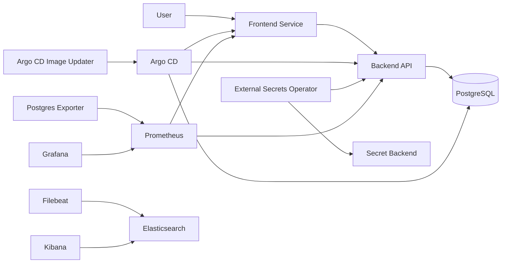

# Infrastructure Analysis Report

## 1. Scope and Objective

This report analyzes the current GitOps Galaxy infrastructure and defines migration planning inputs for cloud cost analysis.

Target outcome:
- Understand baseline resource behavior
- Map dependencies and data flows
- Identify constraints and bottlenecks
- Translate infrastructure needs into cloud-ready requirements

## 2. Current State 

- `azure-k3s-cluster/main.tf`
- `azure-k3s-cluster/argocd.tf`
- `azure-k3s-cluster/monitoring.tf`
- `azure-k3s-cluster/myapp/values.yaml`
- `azure-k3s-cluster/manifests/argocd/apps/*.yaml`
- `backend/main.py`
- `frontend/server.js`

## 2.1 Platform and deployment model
- Kubernetes cluster is provisioned with Terraform (`azurerm_kubernetes_cluster`) in `azure-k3s-cluster/main.tf`.
- Current cluster uses a single default node pool (`agentpool`) with VM size `Standard_D4ds_v6`.
- GitOps delivery is managed with Argo CD app-of-apps:
  - Project: `azure-k3s-cluster/manifests/argocd/project.yaml`
  - Root app: `azure-k3s-cluster/manifests/argocd/root-application.yaml`
  - Child apps: `azure-k3s-cluster/manifests/argocd/apps/*.yaml`
- Environments in repo: `app-dev`, `app-staging`, `app-prod`.

### 2.2 Application components
- Frontend: Node/Express (`frontend/server.js`)
- Backend: FastAPI/Python (`backend/main.py`)
- Database: PostgreSQL (Bitnami chart) in `postgres-dev` app (`azure-k3s-cluster/manifests/argocd/apps/postgres-dev.yaml`)
- App Helm chart:
  - Requests/limits and replicas in `azure-k3s-cluster/myapp/values.yaml`
  - Env overlays in `azure-k3s-cluster/myapp/values-dev.yaml`, `azure-k3s-cluster/myapp/values-staging.yaml`, `azure-k3s-cluster/myapp/values-prod.yaml`

### 2.3 Monitoring and logging
- Monitoring stack includes Prometheus and Grafana via `kube-prometheus-stack` (`azure-k3s-cluster/monitoring.tf`).
- Current logging path uses Elasticsearch + Kibana + Filebeat (`azure-k3s-cluster/monitoring.tf` and `azure-k3s-cluster/values/*.yaml`).

## 3. Baseline Performance Methodology

Because local runtime measurements are not embedded in repository artifacts, this report separates:
- **Configured baseline** (from manifests)
- **Measured baseline** (to be collected via load tests + Prometheus)

### 3.1 Measurement setup
- Load generation: Locust
- Observation window:
  - Idle: 30 minutes
  - Normal: 60 minutes
  - Peak: 30 minutes (burst simulation)
- Metrics sources:
  - Node/pod metrics: Prometheus (kube-state-metrics, cAdvisor)
  - App metrics:
    - Backend custom metrics endpoint in `backend/main.py` (`/prom_metrics`)
    - Frontend proxy metrics endpoint in `frontend/server.js` (`/metrics`)
  - DB metrics: postgres exporter + query latency tests

### 3.2 Required captured metrics
- CPU and RAM: avg, p95, peak per component
- Disk: used capacity growth/day, read/write throughput, IOPS
- Network: ingress/egress by service and namespace
- Database: p95 latency, TPS/QPS, connections, storage growth
- Reliability: restart count, OOM kills, probe failures

## 4. Configured Resource Baseline 

### 4.1 Application pod sizing
| Component | Replicas (dev/staging/prod) | CPU request | CPU limit | Memory request | Memory limit |
|---|---:|---:|---:|---:|---:|
| Frontend | 2 / 2 / 3 | 100m | 300m | 128Mi | 256Mi |
| Backend | 2 / 2 / 3 | 150m | 400m | 192Mi | 384Mi |

### 4.2 Estimated app footprint from configured limits
- **Prod (3+3 pods)**:
  - CPU requests: `3*(0.1+0.15)=0.75 vCPU`
  - CPU limits: `3*(0.3+0.4)=2.1 vCPU`
  - Memory requests: `3*(128+192)Mi=960Mi`
  - Memory limits: `3*(256+384)Mi=1920Mi (~1.88Gi)`
- **Dev/Staging (2+2 pods each)**:
  - CPU requests: `2*(0.1+0.15)=0.5 vCPU`
  - CPU limits: `2*(0.3+0.4)=1.4 vCPU`
  - Memory requests: `2*(128+192)Mi=640Mi`
  - Memory limits: `2*(256+384)Mi=1280Mi (~1.25Gi)`

### 4.3 Monitoring/logging baseline from values
- Elasticsearch request/limit in `azure-k3s-cluster/values/elasticsearch-values.yaml`:
  - requests: 250m CPU, 512Mi RAM
  - limits: 500m CPU, 1Gi RAM
  - storage PVC request: 10Gi
- Monitoring stack sizing requires direct measurement under load for production readiness.

## 5. Dependency Analysis

## 5.1 Direct dependencies
- Frontend -> Backend (`BACKEND_HOST/BACKEND_PORT` in `azure-k3s-cluster/myapp/templates/deployment.yaml`)
- Backend -> PostgreSQL (DB env vars from K8s secret in same template)
- Argo CD -> all app namespaces via app-of-apps
- External Secrets Operator -> secret backend (`vault-clustersecretstore.yaml`)

## 5.2 Shared resources
- Kubernetes cluster resources are shared across all app environments
- Container image repos (`docker.io/rasmusjoenurm/frontend`, `docker.io/rasmusjoenurm/backend`) are shared
- Argo CD control plane shared by all environments
- Monitoring stack shared in current layout (migration target separates monitoring per environment)

## 5.3 Visual dependency map

## 6. Data Flow and Network Analysis

### 6.1 Service interaction flows
- North-south:
  - Internet -> public ingress/LB -> frontend
- East-west:
  - frontend -> backend
  - backend -> postgres
  - exporters -> prometheus
  - log shippers -> log backend
- Control plane:
  - Argo CD -> Kubernetes API -> deployments/state

### 6.2 Latency-sensitive and bandwidth-heavy paths
- Latency-sensitive:
  - frontend -> backend
  - backend -> database
- Bandwidth-heavy:
  - log shipping and long retention
  - metrics scraping with short intervals during peak loads

## 7. Resource Constraints and Bottlenecks

### 7.1 Current scaling limitations
- Single node pool in `azure-k3s-cluster/main.tf` can cause contention between app, monitoring, and tools.
- Managed PostgreSQL requirement is not yet reflected in current deployment (`postgres-dev` is in-cluster chart).

### 7.2 Most resource-intensive components (expected)
- Monitoring and logging stack (especially long retention)
- Database I/O and backup storage
- Public egress from frontend-facing services

### 7.3 Potential migration bottlenecks
- Data transfer and egress cost growth
- NAT/LB cost amplification with multi-AZ and multiple environments
- Storage growth from 1-year logs and 30-day DB backups

## 8. Security and Access Requirements Mapping

- Service-to-service auth:
  - K8s service accounts and secrets
  - External Secrets integration for DB credentials
- User access management:
  - Argo CD RBAC in `azure-k3s-cluster/argocd.tf`
- IAM best practices required for migration target:
  - least privilege roles
  - environment isolation (test/prod/shared)
  - separate projects/accounts/subscriptions for blast-radius reduction
- Data protection:
  - encryption at rest for DB, volumes, object storage, registry
  - TLS in transit for public and internal traffic

## 9. Infrastructure Requirements for Cloud Costing

Required in target architecture:
- 2 Kubernetes clusters: test + prod
- Prod cluster spread across multiple AZs
- Separate node pools:
  - `main` (application)
  - `monitoring`
  - `tools`
- Managed PostgreSQL with HA (prod), backups, PITR
- Private container registry
- Public and private DNS zones
- VPN for private access
- Monitoring per environment with required retention

